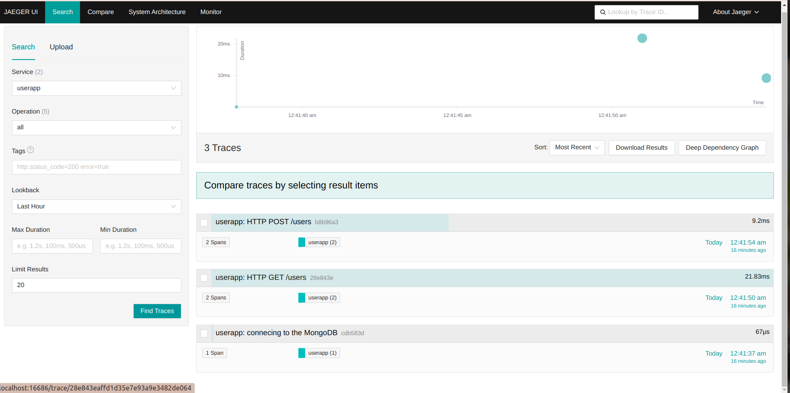

# Distributed Tracing with OpenTelemetry for Go APIs
This project is a simple Go application providing a REST API to manage users. The application uses MongoDB as a database and includes OpenTelemetry tracing to send trace data to a distributed tracing backend via an OpenTelemetry Collector.

# Pre-requisites 
- Working K8s cluster
- Cert-manager deployed for certificates generation by Jaeagr operator

# Install Jaegar Operator
```
kubectl create ns observability
kubectl apply -f jaegar-operator.yaml

```
# Deploy a MongoDB statefulset
```
kubectl apply -f mongo.yaml
```
# Install OpenTel Operator
```
kubectl apply -f opentel-operator.yaml
```
# Install Jaeagr Custom Resource
``` 
kubectl apply -f jaegar.yaml
```
# Install OpenTel colllector Daemonset
```
kubectl apply -f opentel-collector-ds.yaml
```
# Install OpenTel colllector Deployment
```
kubectl apply -f opentel-collector.yaml
```
# Test it locally 

```
 export OTLP_ENDPOINT=localhost:4318
 export MONGO_URI=mongodb://localhost:27017
 go run .
```


# Result
